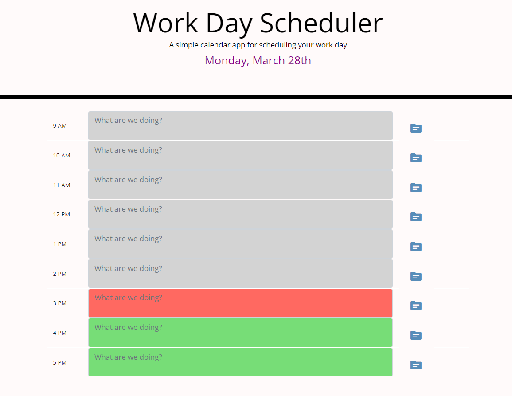

# day planner
Work day planner

This application is a simple one day task manager that allows user to plan the office hours for the each hour. This is a browser based application and feature's dynamically updated with HTML. CSS, JavaScript, JQuery and Moment.js.

## Web application screenshot

## https://kartavya99.github.io/dayplanner/

## Technologies - Libraries
### - Bootstrap - CSS Framework 
Used for existing html and CSS for creating responsive organizational structure and styling for the site.
### - Jquery - JavaScript Library
Used of event event listeners and to store and recall data stored in variable in windows local storage. 
### - Moment.js - JavaScript Library
Used for dynamically change and update date and current time block with different colours.

